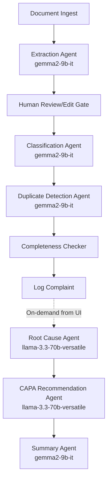
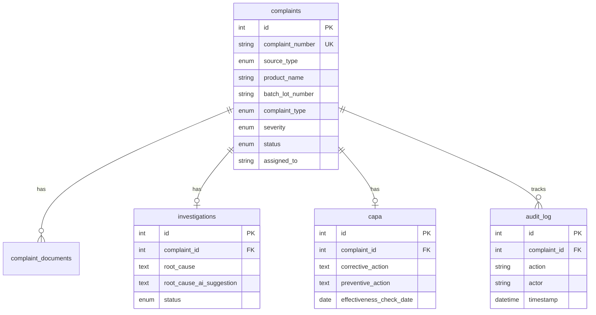

# Architecture Documentation

## LangGraph Agent Flow

## Data Model Relationships

## State Persistence

LangGraph intermediate outputs are persisted via:
1. **Complaint record fields** — classification, severity, rationale stored on the complaint
2. **Investigation/CAPA records** — AI suggestions stored separately from human-confirmed values
3. **Audit log** — Every agent invocation logged with timestamp and actor
4. **`langgraph_state` JSON column** — Reserved for full graph state serialization on re-runs

## LLM Model Selection

| Agent | Model | Rationale |
|-------|-------|-----------|
| Extraction | gemma2-9b-it | Fast structured field parsing |
| Classification | gemma2-9b-it | Quick categorization with rationale |
| Duplicate Detection | gemma2-9b-it | Comparison against existing records |
| Root Cause Analysis | llama-3.3-70b-versatile | Deep reasoning, 5-Whys methodology |
| CAPA Recommendation | llama-3.3-70b-versatile | Complex corrective/preventive planning |
| Executive Summary | gemma2-9b-it | Concise narrative generation |

## Frontend Redux Slices

| Slice | Purpose |
|-------|---------|
| `complaints` | List view, filters, kanban data |
| `currentComplaint` | Detail view, agent run flags, draft intake form |
| `dashboard` | Summary counts, trend data |

Agent status flags in `currentComplaint`: `extracting`, `classifying`, `rootCause`, `capa`, `summarizing`
